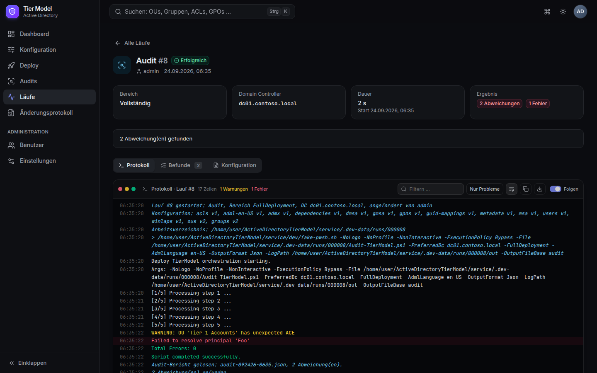
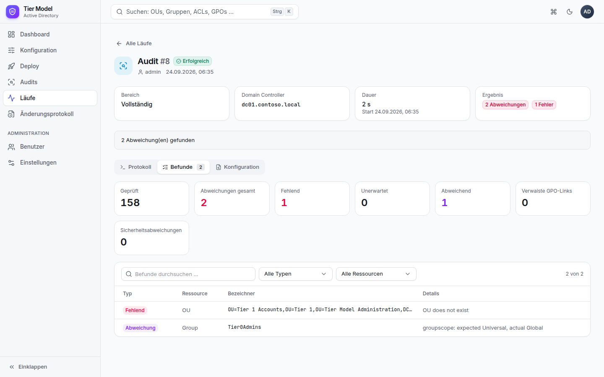

# 🏛️ Active Directory Tier Model

> **Fork** von [microsoft/ActiveDirectoryTierModel](https://github.com/microsoft/ActiveDirectoryTierModel) mit einem
> Windows-Dienst samt Weboberfläche für den dauerhaften Betrieb.

Das Framework richtet ein Active-Directory-Tier-Model (Tier 0/1/2) deklarativ aus JSON-Konfiguration ein und erkennt
Abweichungen (Drift). Dieser Fork ergänzt:

| Erweiterung | Beschreibung |
|---|---|
| **TierModel Service** | Windows-Dienst mit moderner Weboberfläche, PostgreSQL-Datenbank, Benutzern und Rollen |
| **Installer** | `Setup.cmd` – ein Assistent fragt alles Nötige ab und richtet Dienst, Datenbank, Zertifikat und Firewall automatisch ein |
| **Versionierte Konfiguration** | Formulare statt JSON-Dateien, jede Änderung als Version mit Autor, Kommentar, Diff und Wiederherstellung |
| **Deploy & Audit per Klick** | Warteschlange, Live-Protokoll, Planen vor Anwenden, Freigabe nur durch Operatoren |
| **Geplante Audits** | Drift-Erkennung per Zeitplan mit Verlauf im Dashboard |
| **Windows-Anmeldung** | Single Sign-on mit dem Domänenkonto, Rollen über AD-Gruppen |
| **Vier-Augen-Prinzip** | Änderungen am AD erst nach Freigabe durch eine zweite Person, mit festgeschriebenem Konfigurationsstand |
| **Benachrichtigungen** | E-Mail, Microsoft Teams und Webhooks bei Drift, Fehlern, Anwenden und offenen Freigaben |
| **Weitere Host-Sprachen** | Deploy und Audit laufen auch auf Windows-Servern mit deutscher und 17 weiteren Systemsprachen ([Einschränkungen](#sprachen)) |

| Dashboard | Konfiguration bearbeiten |
|---|---|
|  |  |
| **Lauf mit Live-Protokoll** | **Audit-Befunde** |
|  |  |

---

## 🚀 Schnellstart

### Variante A – TierModel Service (empfohlen)

```powershell
# 1. Installationspaket bauen (Windows, Linux oder macOS mit PowerShell 7, .NET 10 SDK, Node.js 20+)
pwsh service/build/Build-Release.ps1
#    → service/artifacts/TierModelService-<Version>.zip

# 2. ZIP auf den Windows Server kopieren, entpacken, Setup.cmd doppelklicken
```

Der Assistent prüft die Voraussetzungen, installiert bei Bedarf PowerShell 7, die RSAT-Module und PostgreSQL,
legt Datenbank und Datenbankbenutzer an und richtet Dienstkonto (gMSA), HTTPS-Zertifikat, Firewall, Windows-Dienst und
das erste Administratorkonto ein. Anschließend ist die Oberfläche unter `https://<server>:8443/` erreichbar.

➡️ **[Installationsanleitung](docs/service/installation.md)** – inklusive Vorbereitung des Dienstkontos.

### Variante B – Skripte direkt (wie im Original)

```powershell
# Planen: zeigt, was sich ändern würde (keine Änderungen am AD)
.\Deploy-TierModel.ps1 -PreferredDc dc01.contoso.com -FullDeployment

# Anwenden (fragt zur Sicherheit nach)
.\Deploy-TierModel.ps1 -PreferredDc dc01.contoso.com -FullDeployment -ConfirmApply

# Drift prüfen, Bericht als JSON
.\Audit-TierModel.ps1 -PreferredDc dc01.contoso.com -FullDeployment -OutputFormat Json -OutputFileBase audit
```

Statt `-FullDeployment` ist genau ein Teilbereich möglich (`-OuOnly`, `-GroupOnly`, `-UserOnly`, `-GposOnly`,
`-OuAclsOnly`, `-AdmxOnly`). Die Erweiterungen `-IncludeMsa`, `-IncludeGmsa`, `-IncludeDmsa` und `-IncludeWinLaps`
gehen nur zusammen mit `-FullDeployment` oder allein.

## 📋 Voraussetzungen des Frameworks

Deploy und Audit prüfen vor jedem Lauf (`Test-TierModelPrerequisites`):

| Anforderung | Details |
|---|---|
| PowerShell | 7.0 oder neuer |
| Rechte | Ausführung als Administrator; das ausführende Konto muss (auch verschachtelt) Mitglied von **Domain Admins** sein |
| Module | `ActiveDirectory`, `GroupPolicy` (RSAT) und Pester 5.x (siehe `config/dependencies.json`) |
| Domänencontroller | über `-PreferredDc` erreichbar |
| Sprache | siehe [Sprachen](#sprachen) |

Beim TierModel Service gelten diese Anforderungen für das **Dienstkonto**.

## 🖥️ TierModel Service

| Bereich | Funktionen |
|---|---|
| **Dashboard** | Kennzahlen, letzter Audit-/Deploy-Status, Drift-Verlauf, OU-Baum mit Tier-Farben, letzte Läufe und Änderungen |
| **Konfiguration** | Formulare für OUs, Gruppen, Konten, ACL-Delegationen, MSA/gMSA/dMSA und Windows LAPS; JSON-Editor für GPOs, ADMX und Co.; Rückgängig/Wiederholen, Diff vor dem Speichern, Versionen und Wiederherstellung, Validierung, OUs umbenennen und verschieben mit Anpassung aller Verweise, Export |
| **Deploy** | Planen (WhatIf) oder Anwenden – Anwenden nur für Operatoren, mit Bestätigung und nur ohne Validierungsfehler |
| **Audits** | sofort oder per Zeitplan (Cron + Zeitzone), Befunde je Lauf |
| **Läufe** | Warteschlange, Live-Protokoll, Abbrechen, verwendete Konfigurationsversionen |
| **Änderungsprotokoll** | wer hat wann was geändert, gestartet oder freigegeben |
| **Administration** | Benutzer mit Rollen (Betrachter, Bearbeiter, Operator, Administrator), Windows-Anmeldung mit AD-Gruppen, Benachrichtigungen, Vier-Augen-Prinzip, Einstellungen |

**Technik:** ASP.NET Core 10 als Windows-Dienst (self-contained, keine .NET-Installation nötig), PostgreSQL,
React/TypeScript-Oberfläche, die der Dienst selbst ausliefert. Nur HTTPS, eigene Konten mit Sperre nach
Fehlversuchen, CSRF-Schutz, Content-Security-Policy.

### Dokumentation

| | |
|---|---|
| [Überblick & Architektur](docs/service/index.md) | Wie der Dienst aufgebaut ist und einen Lauf ausführt |
| [Installation](docs/service/installation.md) | Voraussetzungen, Dienstkonto, Assistent, Aktualisieren, Deinstallieren |
| [Bedienung](docs/service/bedienung.md) | Rollen, Konfiguration, Deploy, Audits, Zeitpläne, Läufe |
| [Betrieb](docs/service/betrieb.md) | Konfigurationsdatei, Protokolle, Sicherung, Zertifikat, Kommandozeile, Fehlerbehebung |
| [Sicherheit](docs/service/sicherheit.md) | Einstufung als Tier-0-System, Schutzmaßnahmen, Härtung |
| [Entwicklung](docs/service/entwicklung.md) | Lokale Umgebung, Tests, Release-Paket, Datenbank |
| [REST-API](docs/service/api.md) | Endpunkte und Datenmodelle |

Die Seiten sind Teil der MkDocs-Dokumentation (`mkdocs serve`).

## <a id="sprachen"></a>🌍 Sprachen

Das Original von Microsoft verlangt eine englische Umgebung. In diesem Fork gilt:

- **Host-Betriebssystem:** Die Systemsprache (`InstallLanguage`) darf eine der folgenden sein: Englisch, Deutsch,
  Französisch, Spanisch, Italienisch, Niederländisch, Portugiesisch, Türkisch, Japanisch, Koreanisch, Chinesisch,
  Polnisch, Russisch, Schwedisch, Dänisch, Finnisch, Griechisch, Tschechisch, Ungarisch. Andere Sprachen werden
  weiterhin abgelehnt.
- **Active Directory:** Die Sprache der Domäne wird anhand der integrierten Gruppen (per SID) erkannt und im
  Ergebnis der Voraussetzungsprüfung festgehalten (`AdLanguage`, `AdGroupNames`). Sie wird aber **noch nicht
  verwendet**: Die Konfiguration und die Prüfung auf „Domain Admins“ arbeiten mit den **englischen** Gruppennamen.
  **Domänen mit lokalisierten Gruppennamen (z. B. „Domänen-Admins“) werden daher derzeit nicht unterstützt.**

Die Pester-Tests der Sprachprüfung (`tests/Unit.Prerequisites.Tests.ps1`) beschreiben noch das frühere
Englisch-Verhalten und müssen angepasst werden.

## 📁 Projektstruktur

```
ActiveDirectoryTierModel/
├── Deploy-TierModel.ps1          Bereitstellung (Planen/Anwenden)
├── Audit-TierModel.ps1           Drift-Erkennung
├── config/                       Soll-Konfiguration (JSON), GPO-Sicherungen, ADMX/ADML
├── modules/TierModel/            PowerShell-Modul (60 öffentliche Cmdlets)
├── tests/                        Pester-Tests des Frameworks (1.435 Testfälle)
├── optional/                     Authentication Silos, Sentinel-Regeln, Auditing, Migration
├── service/                      TierModel Service
│   ├── src/TierModel.Service/    Backend (ASP.NET Core 10)
│   ├── web/                      Weboberfläche (React, TypeScript)
│   ├── installer/                Setup.cmd + Installationsassistent
│   ├── build/                    Build-Release.ps1
│   └── tests/                    Unit- und API-Tests
├── docs/                         Dokumentation (MkDocs), service/ = Dienst
└── specs/                        Spezifikationen
```

## 🧪 Tests

```powershell
# Framework (Windows, Pester 5)
./tests/Invoke-AllTests.ps1

# Dienst
dotnet test service/TierModel.Service.slnx
```

## 🔗 Links

| | |
|---|---|
| Dieser Fork | <https://github.com/wsjrosiris/ActiveDirectoryTierModel> |
| Original | <https://github.com/microsoft/ActiveDirectoryTierModel> |
| Dokumentation (Microsoft) | <https://microsoft.github.io/ActiveDirectoryTierModel> |
| Änderungen | [CHANGELOG.md](CHANGELOG.md) |

---

**Version**: 1.4.0 · **Basis**: Microsoft Tier Model 1.2.2 · **Lizenz**: MIT
