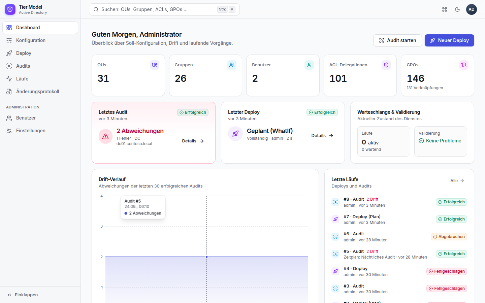
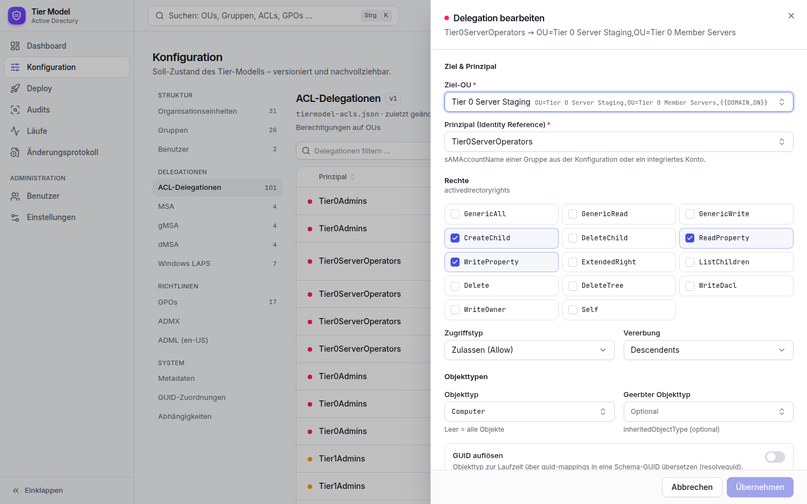
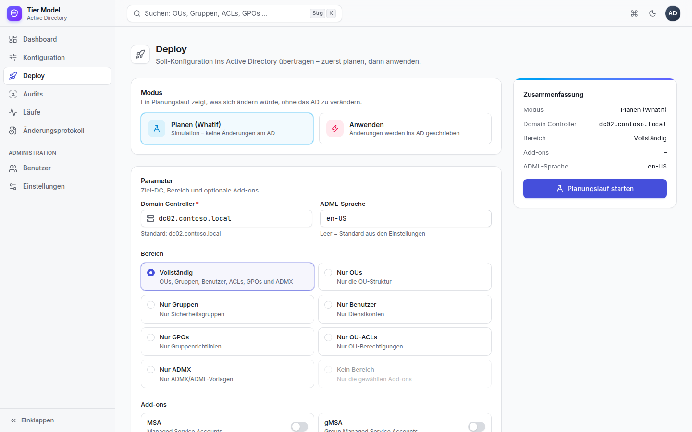
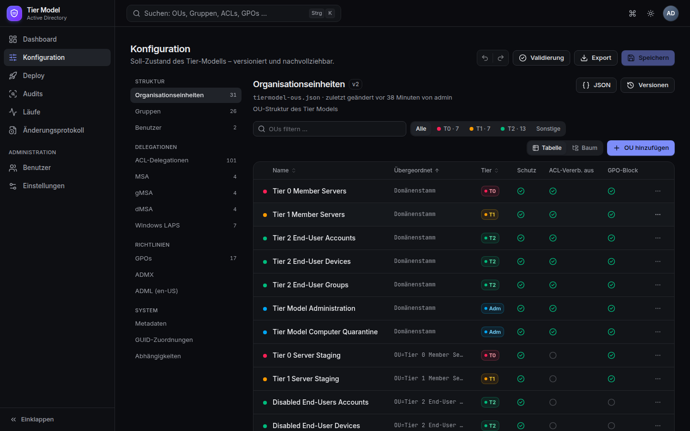

# 🏛️ Active Directory Tier Model

> **Fork** von [microsoft/ActiveDirectoryTierModel](https://github.com/microsoft/ActiveDirectoryTierModel) mit erweiterten Features fuer den produktiven Einsatz.

Dieses Repository basiert auf dem offiziellen Microsoft Active Directory Tier Model Framework und fuegt folgende Erweiterungen hinzu:

| Feature | Status | Beschreibung |
|---------|--------|-------------|
| **Multi-Language Support** | ✅ Neu | 19 Sprachen (DE, EN, FR, ES, ...) statt nur Englisch |
| **TierModel Service** | ✅ Neu | Windows-Dienst mit moderner Web-Oberfläche, PostgreSQL, Benutzern & Rollen |
| **Installer** | ✅ Neu | `Setup.cmd` – interaktiver Assistent richtet alles automatisch ein |
| **Versionierte Konfiguration** | ✅ Neu | Formulare statt JSON, jede Änderung als Version mit Diff und Wiederherstellung |
| **Geplante Audits** | ✅ Neu | Drift-Erkennung per Zeitplan, Historie und Trend |

---

## 📦 Original von Microsoft

Das Kern-Framework stammt von Microsoft und bietet:

- Declarative PowerShell-Deployments aus JSON-Konfiguration
- Idempotent re-runs, Drift Detection, reproduzierbare Builds
- OUs, Groups, Users, ACL Delegations, GPOs, ADMX, MSA/gMSA/dMSA, Windows LAPS
- 1.766 Tests, 88.72% Code Coverage
- [Original Dokumentation](https://microsoft.github.io/ActiveDirectoryTierModel) | [Original Repository](https://github.com/microsoft/ActiveDirectoryTierModel)

### Originale Scripts (von Microsoft)
| Script | Beschreibung |
|--------|-------------|
| `Deploy-TierModel.ps1` | Tier Model deployen |
| `Audit-TierModel.ps1` | Drift Detection / Audit |

---

## 🆕 Neue Features (dieser Fork)

### 🌍 Multi-Language Support

Das originale Microsoft-Framework unterstuetzt ausschliesslich Englisch (`en-US`). Dieser Fork entfernt diese Einschraenkung und unterstuetzt **19 Sprachen** sowohl fuer das Host-Betriebssystem als auch fuer Active Directory.

**Geaenderte Dateien:**
- `modules/TierModel/public/Test-TierModelPrerequisites.ps1` — Host-OS Check (Zeile 138-169) und AD-Gruppenname Check (Zeile 419-478)

**Wie es funktioniert:**
1. Liest `InstallLanguage` aus der Registry (`HKLM:\SYSTEM\CurrentControlSet\Control\Nls\Language`)
2. Erkennt die AD-Sprache anhand der bekannten Gruppennamen (SID-basiert)
3. Kein Fail-fast mehr - das System passt sich automatisch an

<details>
<summary>Alle 19 unterstuetzten Sprachen</summary>

| Sprache | LCID | AD Gruppennamen |
|---------|------|-----------------|
| English (en-US) | `0x09` | Domain Admins, Server Operators, Account Operators |
| **German (de-DE)** | `0x07` | Domänen-Admins, Server-Operatoren, Konten-Operatoren |
| French (fr-FR) | `0x0c` | Administrateurs du domaine, Opérateurs de serveur |
| Spanish (es-ES) | `0x0a` | Administradores del dominio, Operadores de servidor |
| Italian (it-IT) | `0x10` | Amministratori del dominio, Operatori server |
| Dutch (nl-NL) | `0x13` | Domeinbeheerders, Serveroperators |
| Portuguese (pt-BR) | `0x16` | Administradores do domínio, Operadores de Servidor |
| Turkish (tr-TR) | `0x14` | Etki Alanı Yöneticileri, Sunucu İşletmenleri |
| Japanese (ja-JP) | `0x11` | ドメイン管理者, Server Operators |
| Korean (ko-KR) | `0x12` | 도메인 관리자, 서버 운영자 |
| Chinese (zh-CN) | `0x04` | 域管理员, 服务器操作员 |
| Polish (pl-PL) | `0x15` | Administratorzy domeny, Operatorzy serwera |
| Russian (ru-RU) | `0x19` | Администраторы домена, Операторы сервера |
| Swedish (sv-SE) | `0x1d` | Domänadministratörer, Serveroperatörer |
| Danish (da-DK) | `0x06` | Domæneadministratorer, Serveroperatører |
| Finnish (fi-FI) | `0x0b` | Verkkotunnusylläpitäjät, Palvelimen operaattorit |
| Greek (el-GR) | `0x08` | Διαχειριστές τομέα, Χειριστές διακομιστή |
| Czech (cs-CZ) | `0x05` | Správci domény, Operátoři serveru |
| Hungarian (hu-HU) | `0x0e` | Tartományrendszergazdák, Szerverüzemeltetők |

</details>

---

### 🖥️ TierModel Service (Web-Oberfläche + Windows-Dienst)

Ein dauerhaft laufender Dienst auf einem Windows Server mit **PostgreSQL-Datenbank** und moderner Web-Oberfläche.
Er ersetzt die frühere `Start-TierModelManager.ps1`.

| Dashboard | Konfiguration bearbeiten |
|---|---|
|  |  |
| **Lauf mit Live-Log** | **Audit-Befunde** |
|  |  |
| **Deploy** | **OU-Struktur** |
|  |  |

| Bereich | Funktionen |
|---|---|
| **Dashboard** | Kennzahlen, letzter Audit-/Deploy-Status, Drift-Trend, OU-Baum mit Tier-Farben, letzte Läufe und Änderungen |
| **Konfiguration** | Formulare für OUs, Gruppen, Benutzer, ACLs, MSA/gMSA/dMSA, Windows LAPS; JSON-Editor für GPOs/ADMX; Rückgängig/Wiederholen, Diff vor dem Speichern, Versionen und Wiederherstellung, Validierung, OU-Umbenennung mit Referenz-Update |
| **Deploy** | Planung (WhatIf) oder Anwenden – Anwenden nur für Operatoren und mit ausdrücklicher Bestätigung |
| **Audits** | Sofort oder per Zeitplan (Cron + Zeitzone), Befunde je Lauf |
| **Läufe** | Warteschlange, Live-Log, Abbrechen, verwendete Konfigurationsversionen |
| **Änderungsprotokoll** | Wer hat wann was geändert, gestartet oder angemeldet |
| **Administration** | Benutzer mit Rollen (Viewer, Editor, Operator, Admin), Einstellungen |

**Installation:** Release-Paket auf dem Server entpacken, `Setup.cmd` starten – der Assistent prüft die Voraussetzungen,
installiert bei Bedarf PowerShell 7, RSAT und PostgreSQL, legt Datenbank und DB-Benutzer an und richtet Dienstkonto (gMSA),
HTTPS-Zertifikat, Firewall, Windows-Dienst und das erste Admin-Konto ein.

➡️ Details, Architektur, Sicherheit und Entwicklung: **[service/README.md](service/README.md)** · REST-API: [service/docs/API.md](service/docs/API.md)

---

## 📋 Voraussetzungen

- **PowerShell**: 7.0+
- **Elevation**: Administrator-Rechte
- **Domain Admin**: Mitglied in Domain Admins Gruppe
- **Module**: ActiveDirectory, GroupPolicy
- **Sprache**: 19 Sprachen unterstuetzt (kein English-only mehr)

## 🚀 Erste Schritte

```powershell
# Repository klonen
git clone https://github.com/wsjrosiris/ActiveDirectoryTierModel.git
cd ActiveDirectoryTierModel

# Release-Paket für den Server bauen (PowerShell 7, .NET 10 SDK, Node.js)
pwsh service/build/Build-Release.ps1
# → service/artifacts/TierModelService-<version>.zip auf den Server kopieren, entpacken, Setup.cmd starten

# Oder direkt deployen (original Microsoft Script)
.\Deploy-TierModel.ps1 -PreferredDc dc01.contoso.com -FullDeployment
```

## 📁 Projektstruktur

```
ActiveDirectoryTierModel/
├── Deploy-TierModel.ps1          # [Microsoft] Deploy Script
├── Audit-TierModel.ps1           # [Microsoft] Audit Script
├── service/                      # [NEU] TierModel Service
│   ├── src/TierModel.Service/    #   ASP.NET Core 10 Backend (Windows-Dienst)
│   ├── web/                      #   React-Oberfläche
│   ├── installer/                #   Setup.cmd + Installationsassistent
│   ├── build/                    #   Build-Release.ps1
│   └── tests/                    #   Unit- und API-Tests
├── config/                       # [Microsoft] Konfigurationsdateien
│   ├── tiermodel-ous.json
│   ├── tiermodel-groups.json
│   ├── tiermodel-users.json
│   ├── tiermodel-acls.json
│   └── ...
├── modules/TierModel/            # [Microsoft] PowerShell Modul
│   ├── TierModel.psm1
│   └── public/                   # 60+ Cmdlets
├── tests/                        # [Microsoft] Pester Tests (1.766 Tests)
├── docs/                         # [Microsoft] Dokumentation
└── optional/                     # [Microsoft] Optionale Features
```

## 🔗 Links

| | Link |
|---|------|
| **Fork** | https://github.com/wsjrosiris/ActiveDirectoryTierModel |
| **Original** | https://github.com/microsoft/ActiveDirectoryTierModel |
| **Doku (Microsoft)** | https://microsoft.github.io/ActiveDirectoryTierModel |

---

**Version**: 1.4.0 | **Basis**: Microsoft Tier Model v1.2.2 | **License**: MIT
