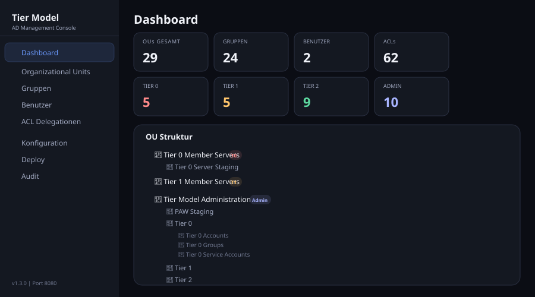
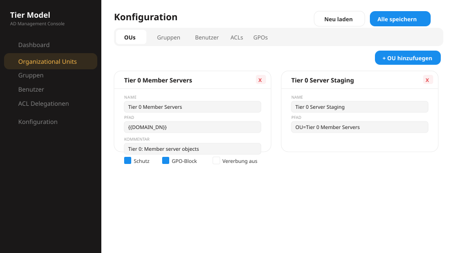
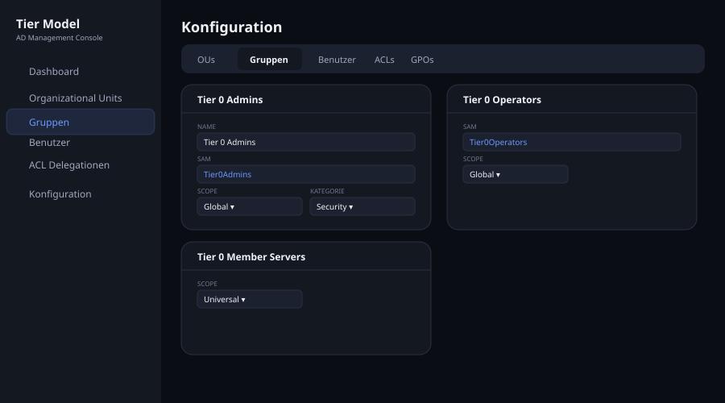
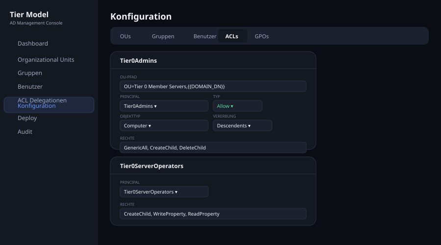
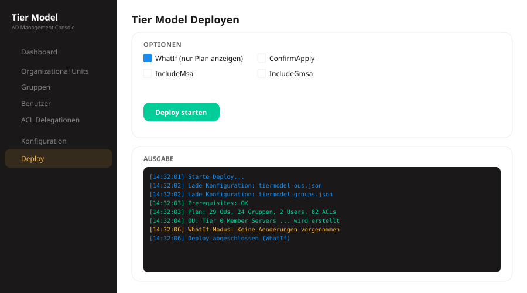
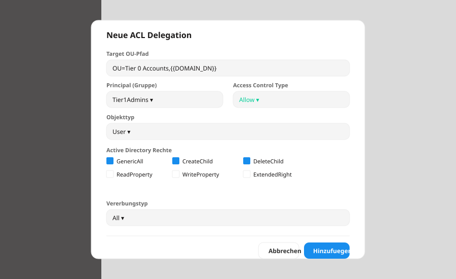

# 🏛️ Active Directory Tier Model

> **Fork** von [microsoft/ActiveDirectoryTierModel](https://github.com/microsoft/ActiveDirectoryTierModel) mit erweiterten Features fuer den produktiven Einsatz.

Dieses Repository basiert auf dem offiziellen Microsoft Active Directory Tier Model Framework und fuegt folgende Erweiterungen hinzu:

| Feature | Status | Beschreibung |
|---------|--------|-------------|
| **Multi-Language Support** | ✅ Neu | 19 Sprachen (DE, EN, FR, ES, ...) statt nur Englisch |
| **Web Management Console** | ✅ Neu | Lokale Web-Oberflaeche zur visuellen Verwaltung |
| **Form-basierte Konfiguration** | ✅ Neu | Kein JSON-Editor - alles per Dropdown/Felder |

---

## 📦 Original von Microsoft

Das Kern-Framework stammt von Microsoft und bietet:

- Declarative PowerShell-Deployments aus JSON-Konfiguration
- Idempotent re-runs, Drift Detection, reproduzierbare Builds
- OUs, Groups, Users, ACL Delegations, GPOs, ADMX, MSA/gMSA/dMSA, Windows LAPS
- 1.766 Tests, 88.72% Code Coverage
- [Original Dokumentation](https://microsoft.github.io/ActiveDirectoryTierModel) | [Original Repository](https://github.com/microsoft/ActiveDirectoryTierModel)

### Originale Scripts (von Microsoft)
| Script | Beschreibung |
|--------|-------------|
| `Deploy-TierModel.ps1` | Tier Model deployen |
| `Audit-TierModel.ps1` | Drift Detection / Audit |

---

## 🆕 Neue Features (dieser Fork)

### 🌍 Multi-Language Support

Das originale Microsoft-Framework unterstuetzt ausschliesslich Englisch (`en-US`). Dieser Fork entfernt diese Einschraenkung und unterstuetzt **19 Sprachen** sowohl fuer das Host-Betriebssystem als auch fuer Active Directory.

**Geaenderte Dateien:**
- `modules/TierModel/public/Test-TierModelPrerequisites.ps1` — Host-OS Check (Zeile 138-169) und AD-Gruppenname Check (Zeile 419-478)

**Wie es funktioniert:**
1. Liest `InstallLanguage` aus der Registry (`HKLM:\SYSTEM\CurrentControlSet\Control\Nls\Language`)
2. Erkennt die AD-Sprache anhand der bekannten Gruppennamen (SID-basiert)
3. Kein Fail-fast mehr - das System passt sich automatisch an

<details>
<summary>Alle 19 unterstuetzten Sprachen</summary>

| Sprache | LCID | AD Gruppennamen |
|---------|------|-----------------|
| English (en-US) | `0x09` | Domain Admins, Server Operators, Account Operators |
| **German (de-DE)** | `0x07` | Domänen-Admins, Server-Operatoren, Konten-Operatoren |
| French (fr-FR) | `0x0c` | Administrateurs du domaine, Opérateurs de serveur |
| Spanish (es-ES) | `0x0a` | Administradores del dominio, Operadores de servidor |
| Italian (it-IT) | `0x10` | Amministratori del dominio, Operatori server |
| Dutch (nl-NL) | `0x13` | Domeinbeheerders, Serveroperators |
| Portuguese (pt-BR) | `0x16` | Administradores do domínio, Operadores de Servidor |
| Turkish (tr-TR) | `0x14` | Etki Alanı Yöneticileri, Sunucu İşletmenleri |
| Japanese (ja-JP) | `0x11` | ドメイン管理者, Server Operators |
| Korean (ko-KR) | `0x12` | 도메인 관리자, 서버 운영자 |
| Chinese (zh-CN) | `0x04` | 域管理员, 服务器操作员 |
| Polish (pl-PL) | `0x15` | Administratorzy domeny, Operatorzy serwera |
| Russian (ru-RU) | `0x19` | Администраторы домена, Операторы сервера |
| Swedish (sv-SE) | `0x1d` | Domänadministratörer, Serveroperatörer |
| Danish (da-DK) | `0x06` | Domæneadministratorer, Serveroperatører |
| Finnish (fi-FI) | `0x0b` | Verkkotunnusylläpitäjät, Palvelimen operaattorit |
| Greek (el-GR) | `0x08` | Διαχειριστές τομέα, Χειριστές διακομιστή |
| Czech (cs-CZ) | `0x05` | Správci domény, Operátoři serveru |
| Hungarian (hu-HU) | `0x0e` | Tartományrendszergazdák, Szerverüzemeltetők |

</details>

---

### 🖥️ Web Management Console

Eine lokale Web-Anwendung zur visuellen Verwaltung des Tier Models. Startet einen PowerShell-Webserver auf Port 8080.

```powershell
.\Start-TierModelManager.ps1
# Browser oeffnet automatisch: http://localhost:8080
```

**Neue Datei:** `Start-TierModelManager.ps1`

#### Dashboard
Zeigt Statistiken (OUs, Gruppen, User, ACLs) und eine interaktive OU-Baumstruktur mit Tier-Badges (T0/T1/T2).



#### Konfiguration - OUs
Formular-basierte Verwaltung aller Organizational Units mit Feldern fuer Name, Pfad, Kommentar, Schutz- und GPO-Block-Checkboxes.



#### Konfiguration - Gruppen
Sicherheitsgruppen verwalten mit Dropdowns fuer Scope (Global/Universal/DomainLocal) und Kategorie (Security/Distribution).



#### Konfiguration - ACLs
ACL-Delegationen mit Principal-Dropdown (aus Gruppen), Access-Typ, Objekttyp und Vererbungs-Dropdowns.



#### Deploy & Audit
`Deploy-TierModel.ps1` und `Audit-TierModel.ps1` direkt aus der Web-Oberflaeche ausfuehren mit Optionen (WhatIf, MSA, gMSA, dMSA, WinLAPS).



#### Modal - Neue ACL hinzufuegen
Rechte-Auswahl per Checkbox-Grid (GenericAll, CreateChild, DeleteChild, ReadProperty, WriteProperty, ExtendedRight).



#### Features der Web Console

| Seite | Funktionen |
|-------|-----------|
| **Dashboard** | Statistiken, OU-Baum mit Tier-Badges |
| **OUs** | Tabelle mit Suche, Hinzufuegen, Loeschen |
| **Gruppen** | Sicherheitsgruppen verwalten |
| **Benutzer** | Service-Accounts (aktiv/inaktiv) |
| **ACLs** | OU-Berechtigungen verwalten |
| **Konfiguration** | 5 Tabs (OUs/Gruppen/Benutzer/ACLs/GPOs) mit Formularen |
| **Deploy** | Tier Model deployen mit Optionen |
| **Audit** | Drift Detection ausfuehren |

#### API Endpunkte

| Endpoint | Methode | Beschreibung |
|----------|---------|-------------|
| `GET /` | GET | HTML Oberflaeche |
| `GET /api/config/{file}` | GET | JSON-Konfiguration lesen |
| `POST /api/config/{file}` | POST | JSON-Konfiguration speichern |
| `POST /api/deploy` | POST | Deploy-TierModel.ps1 ausfuehren |
| `POST /api/audit` | POST | Audit-TierModel.ps1 ausfuehren |

---

## 📋 Voraussetzungen

- **PowerShell**: 7.0+
- **Elevation**: Administrator-Rechte
- **Domain Admin**: Mitglied in Domain Admins Gruppe
- **Module**: ActiveDirectory, GroupPolicy
- **Sprache**: 19 Sprachen unterstuetzt (kein English-only mehr)

## 🚀 Erste Schritte

```powershell
# Repository klonen
git clone https://github.com/wsjrosiris/ActiveDirectoryTierModel.git
cd ActiveDirectoryTierModel

# Web Console starten
.\Start-TierModelManager.ps1

# Oder direkt deployen (original Microsoft Script)
.\Deploy-TierModel.ps1 -WhatIf
```

## 📁 Projektstruktur

```
ActiveDirectoryTierModel/
├── Deploy-TierModel.ps1          # [Microsoft] Deploy Script
├── Audit-TierModel.ps1           # [Microsoft] Audit Script
├── Start-TierModelManager.ps1    # [NEU] Web Management Console
├── config/                       # [Microsoft] Konfigurationsdateien
│   ├── tiermodel-ous.json
│   ├── tiermodel-groups.json
│   ├── tiermodel-users.json
│   ├── tiermodel-acls.json
│   └── ...
├── modules/TierModel/            # [Microsoft] PowerShell Modul
│   ├── TierModel.psm1
│   └── public/                   # 60+ Cmdlets
├── tests/                        # [Microsoft] Pester Tests (1.766 Tests)
├── docs/
│   └── screenshots/              # [NEU] Screenshots fuer README
└── optional/                     # [Microsoft] Optionale Features
```

## 🔗 Links

| | Link |
|---|------|
| **Fork** | https://github.com/wsjrosiris/ActiveDirectoryTierModel |
| **Original** | https://github.com/microsoft/ActiveDirectoryTierModel |
| **Doku (Microsoft)** | https://microsoft.github.io/ActiveDirectoryTierModel |
| **Mockup** | [tiermodel-mockup.html](docs/tiermodel-mockup.html) |

---

**Version**: 1.3.0 | **Basis**: Microsoft Tier Model v1.2.2 | **License**: MIT
