# Bedienung

Die Oberfläche ist unter `https://<server>:<port>/` erreichbar (Standard-Port 8443). Hell- und Dunkelmodus
schalten sich über das Symbol oben rechts um; Voreinstellung ist die Einstellung des Betriebssystems.

## Anmeldung und Rollen

Es gibt zwei Arten von Konten:

- **Windows-Konto** (wenn eingerichtet): **Mit Windows-Konto anmelden** meldet ohne Passworteingabe mit dem
  angemeldeten Domänenkonto an (Kerberos). Die Rolle ergibt sich bei jeder Anmeldung aus den AD-Gruppen, die ein
  Administrator unter **Administration › Windows-Anmeldung** den Rollen zugeordnet hat. Das Konto erscheint nach der
  ersten Anmeldung automatisch in der Benutzerliste.
- **Lokales Konto**: Benutzername und Passwort, angelegt von einem Administrator unter **Administration › Benutzer**.
  Mindestens ein lokales Administratorkonto sollte als Notfallzugang bestehen bleiben.

Für lokale Konten gilt: Neue Konten und zurückgesetzte Passwörter müssen bei der nächsten Anmeldung
ein eigenes Passwort (mindestens 12 Zeichen) vergeben. Nach **5 Fehlversuchen** ist ein Konto 15 Minuten
gesperrt; ein Administrator kann es vorher entsperren.

| Rolle | Darf |
|---|---|
| **Betrachter** (Viewer) | Alles ansehen: Konfiguration, Versionen, Läufe, Protokolle, Änderungsprotokoll |
| **Bearbeiter** (Editor) | + Konfiguration ändern und Versionen wiederherstellen, Audits starten, Deploy im **Planungsmodus** |
| **Operator** | + Deploy **anwenden** (ändert das AD), Läufe abbrechen, Zeitpläne verwalten |
| **Administrator** | + Benutzer und Einstellungen verwalten |

Wer in mehreren zugeordneten AD-Gruppen ist, erhält die höchste Rolle.

Aktionen, die die eigene Rolle nicht erlaubt, sind ausgeblendet oder deaktiviert. Der Dienst prüft die Rolle
zusätzlich bei jedem Aufruf.

## Sprache

Die Oberfläche gibt es auf **Deutsch** und **Englisch**. Im Benutzermenü › *Sprache*: Deutsch, English oder
*Browser-Standard* (Standard). Die Wahl wird am Benutzerkonto gespeichert; die Anmeldeseite folgt vorher der
Browsersprache. Englische Datums- und Zeitangaben verwenden das britische Format (Tag vor Monat, 24 Stunden).

Meldungen des Dienstes erscheinen in der gewählten Sprache. Texte, die der Dienst **speichert oder versendet**
(Änderungsprotokoll, Laufmeldungen, Befunde, Benachrichtigungen, per E-Mail versandte Berichte), werden in der
**Standardsprache der Instanz** geschrieben (*Einstellungen › Sprache*, Standard Deutsch) und später nicht übersetzt.
Protokolle der PowerShell-Skripte bleiben englisch/deutsch wie vom Framework ausgegeben.

## Tastenkürzel

| Kürzel | Funktion |
|---|---|
| `Strg` + `K` | Globale Suche über OUs, Gruppen, Konten, ACLs, GPOs und Seiten |
| `Strg` + `Umschalt` + `P` | Befehlspalette (Navigation, neuer Deploy, Audit starten, Design, Abmelden) |
| `Strg` + `Z` / `Strg` + `Y` | Rückgängig / Wiederholen in der Konfiguration |
| `Strg` + `S` | Konfigurationsänderungen speichern |

## Mehrere Domänen

Ein Dienst kann mehrere Domänen verwalten – auch aus verschiedenen Gesamtstrukturen, sofern das Dienstkonto dort
berechtigt ist (Vertrauensstellung). Jede Domäne hat ihre **eigene Konfiguration**, eigene Läufe, Zeitpläne,
Überwachung, JIT-Gruppen, Einrichtung, Standard-DC und ADML-Sprache. Gemeinsam sind Benutzer und Rollen,
Benachrichtigungskanäle, SIEM, API-Tokens und Wartungsfenster (diese optional auf Domänen beschränkbar).

Sobald mehr als eine Domäne aktiv ist, erscheint oben der **Domänen-Umschalter** (mit Suche). Die Auswahl gilt
für alle Seiten und wird je Benutzer im Browser gemerkt. Nicht gespeicherte Konfigurationsänderungen bleiben je
Domäne erhalten; vor dem Umschalten erscheint ein Hinweis (ein Neuladen des Browsers verwirft sie). Das Dashboard
nennt die aktuelle Domäne und zeigt unter *Alle Domänen* den Compliance-Wert jeder Domäne.

**Administration › Domänen**: Schlüssel (kurz, z. B. `contoso`), Anzeigename, DNS-Name, Standard-DC, ADML-Sprache,
aktiv, Standard; **Verbindung prüfen** liest die Domäne über den DC. Neue Domänen starten mit der mitgelieferten
Beispielkonfiguration und eigener Einrichtung. Löschen ist nur ohne Historie möglich, sonst deaktivieren
(deaktivierte Domänen sind nur lesbar).

## Dashboard

- **Kennzahlen**: OUs, Gruppen, Konten, ACL-Delegationen, GPOs und GPO-Verknüpfungen der aktuellen Konfiguration
- **Letztes Audit**: Status und Anzahl der Abweichungen (grün „Kein Drift“ oder rot)
- **Letzter Deploy**, **Warteschlange** und **Validierung** der Konfiguration
- **Drift-Verlauf** der letzten 30 erfolgreichen Audits
- **Letzte Läufe** und **letzte Änderungen**
- **OU-Baum** mit Tier-Farben (Tier 0 rot, Tier 1 bernstein, Tier 2 grün)

## Konfiguration

Links stehen die Bereiche, gruppiert nach *Struktur*, *Delegationen*, *Richtlinien* und *System*. Jeder Bereich
entspricht einer Datei des Frameworks (z. B. `tiermodel-groups.json`); die Versionsnummer steht neben dem Titel.

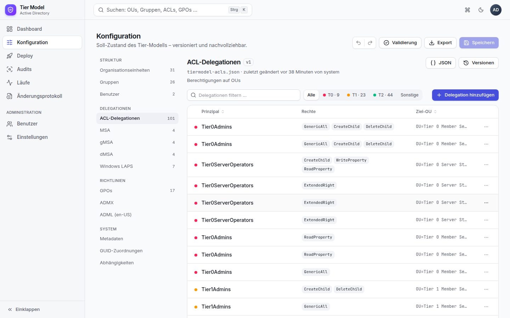

### Einträge bearbeiten

**OUs, Gruppen, Konten, ACL-Delegationen, MSA/gMSA/dMSA und Windows LAPS** werden in Tabellen mit Suche, Tier-Filter
und Sortierung angezeigt. Ein Klick auf eine Zeile öffnet das Bearbeitungsfenster; über **…** lässt sich ein Eintrag
duplizieren oder löschen. Auswahlfelder bieten die gültigen Werte an, z. B. Ziel-OUs aus der OU-Struktur und
Principals aus den konfigurierten Gruppen.

Felder, die das Formular nicht kennt, bleiben beim Speichern unverändert erhalten.

Auch alle übrigen Bereiche haben eigene Formulare – nirgends muss JSON getippt werden:

- **GPOs**: links die Verknüpfungsziele (OUs, Domänenstamm), rechts pro Ziel die Listen *Nur importieren* und
  *Importieren & konfigurieren*. Die GPO-Sicherung wird aus den Backups unter `config\gpo` ausgewählt,
  Benutzerrechte, Gruppen, Filter und Verknüpfungsreihenfolge über Auswahlfelder gepflegt.
- **ADMX / ADML**: Vorlagendateien werden aus `config\admx` ausgewählt, die MD5-Prüfsumme wird automatisch übernommen.
- **GUID-Zuordnungen** und **Abhängigkeiten**: Tabellen mit Auswahl der bekannten Einträge.
- **Metadaten** und sonstige Bereiche: ein strukturiertes Formular mit Text-, Zahl-, Ja/Nein- und Listenfeldern.

Wo es sinnvoll ist, schlagen Suchfelder Werte vor: OUs und Gruppen aus der Konfiguration, auf einem
Windows-Server zusätzlich Domain Controller und AD-Gruppen direkt aus dem Active Directory.

### Authentication Silos

Der Bereich **Authentication Silos** (unter *Richtlinien*, Datei `tiermodel-authsilos.json`) hat drei Reiter:

- **Richtlinien**: Name, Beschreibung, *Erzwingen* (aus = Überwachungsmodus), TGT-Lebensdauer (45–600 Minuten) und
  von welchen Geräten aus Anmeldungen erlaubt sind: Domänencontroller und/oder Gerätegruppen. Die Regel wird als Satz
  angezeigt („Anmeldung nur von Domänencontrollern oder Geräten in Tier0PAWDevices …“); die technische Form erzeugt
  das Framework.
- **Silos**: Richtlinien für Benutzer, Computer und Dienste, Mitglieder über Benutzer-OUs, Computer-OUs und
  Computergruppen, Ausnahmen.
- **Gerätegruppen-Synchronisierung**: Computer aus Quell-OUs werden in eine Gerätegruppe aufgenommen.

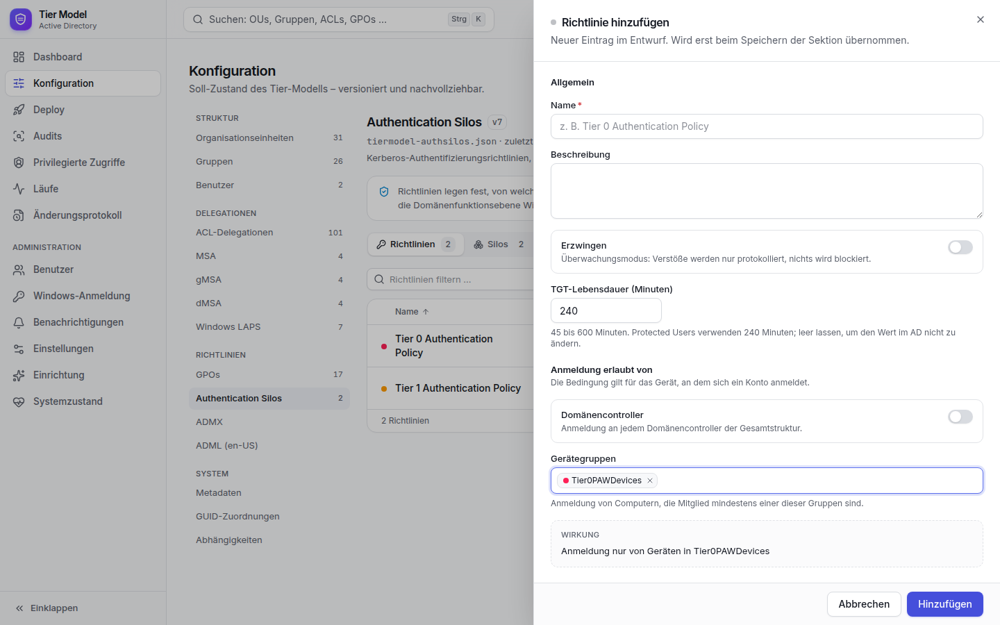

Eine Tier-0-Richtlinie, die Geräte aus Tier 1/2 zulässt, ist ein Tier-Verstoß. Ausgerollt wird mit dem Bereich
*Nur Authentication Silos* oder als letzte Phase von *Vollständig*. Zuerst im Überwachungsmodus einführen, siehe
[Authentication Silos](../authentication-silos.md).

### Soll, Ist und Vergleich

Bei den **Organisationseinheiten** schaltet **Soll | Ist | Vergleich** zwischen Konfiguration, dem tatsächlichen
OU-Baum im AD und dem Abgleich beider um. Der Vergleich markiert jede OU als *fehlt im AD*, *nur im AD*, *abweichend*
oder *gleich*; die Details nennen die Unterschiede bei ACEs und GPO-Verknüpfungen als Sätze. OUs, die nur im AD
existieren, lassen sich **in die Konfiguration übernehmen**. Die Daten werden 60 Sekunden zwischengespeichert
(**Neu laden**). Die Ist-Ansicht braucht den Dienst auf einem Windows-Server in der Domäne.

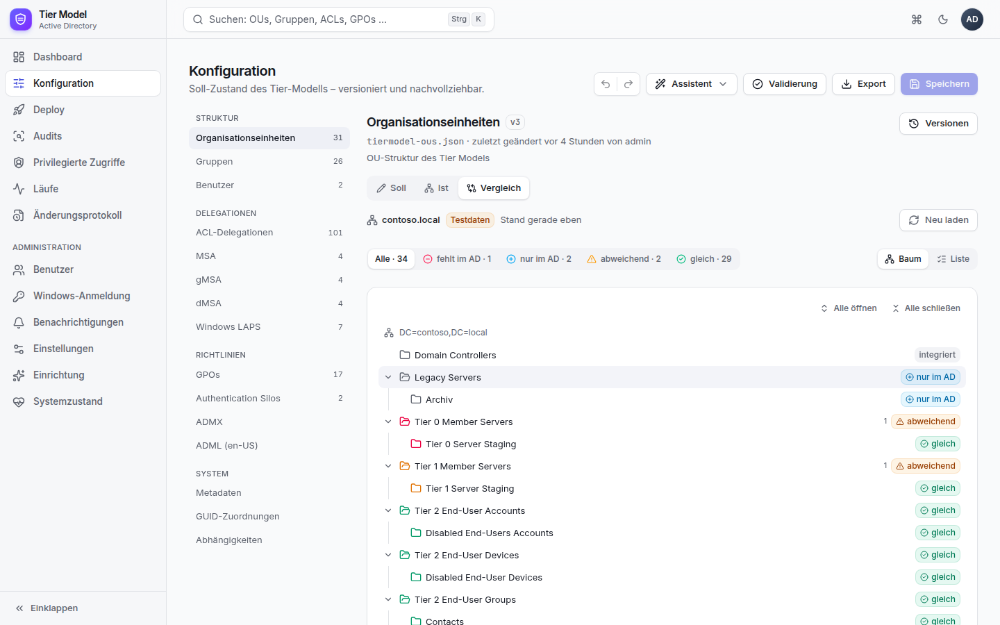

### Assistenten

**Assistent** im Kopf der Konfiguration (Bearbeiter) führt durch häufige Aufgaben, die mehrere Bereiche betreffen:

| Assistent | Ergebnis |
|---|---|
| Neuen Server-Bereich aufnehmen | OU (optional mit Staging-OU), Admin-Gruppe, ACL-Delegation (Vollzugriff oder nur Domänenbeitritt) und die GPO-Verknüpfungen der Nachbar-OUs desselben Tiers |
| Neues Admin-Konto | Konto in der Accounts-OU des Tiers, Gruppen desselben Tiers, auf Wunsch *Protected Users* |
| Neue Delegation | Wer, was, wo – mit Live-Prüfung der Tier-Regeln |

Die Zusammenfassung zeigt jede Änderung als Satz und prüft die Tier-Regeln; Fehler verhindern das Übernehmen. Das
Ergebnis landet als **ein** Schritt im Entwurf (Strg+Z nimmt alles zurück) und wird wie gewohnt gespeichert.

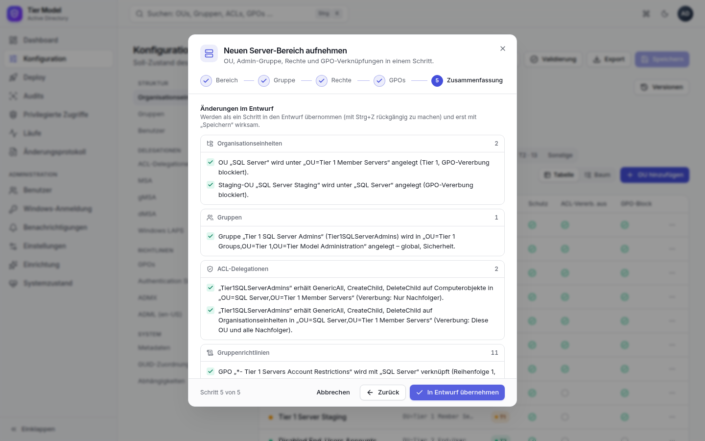

### OU umbenennen oder verschieben

Name und übergeordnete OU einer bestehenden OU werden über **Umbenennen / Verschieben …** geändert. Eine Vorschau
zeigt alle betroffenen Verweise: untergeordnete OUs, Gruppen- und
Kontopfade, ACL-/MSA-/gMSA-/dMSA-Ziele, LAPS-OUs und GPO-Verknüpfungen. Alle Verweise werden in einem Schritt
angepasst und lassen sich mit einem Rückgängig zurücknehmen. Eine OU lässt sich nicht unter sich selbst verschieben;
kollidiert das neue Ziel mit einer vorhandenen GPO-Verknüpfung, wird die Änderung abgelehnt.

### Speichern

Änderungen sind zunächst ein **Entwurf** (Leiste „Ungespeicherte Änderungen“), auch über mehrere Bereiche hinweg.
**Speichern** zeigt für jeden geänderten Bereich eine lesbare Änderungsliste (hinzugefügt, geändert, entfernt – mit
Feldnamen statt JSON-Pfaden) und verlangt einen **Kommentar**. Jeder gespeicherte
Bereich erhält eine neue Version.

Hat jemand anderes denselben Bereich inzwischen gespeichert, erscheint ein **Konflikt** – auch dann, wenn die
Oberfläche die neue Version im Hintergrund schon geladen hat:
*Neu laden* verwirft den eigenen Entwurf; *Weiter bearbeiten* behält ihn, und der nächste Diff zeigt, welche
Änderungen der anderen Person das eigene Speichern zurücknehmen würde.

Läuft die Sitzung während des Speicherns ab,
bleiben die Entwürfe erhalten: in einem neuen Tab anmelden und erneut speichern.

### Versionen

**Versionen** zeigt alle Stände eines Bereichs mit Autor, Zeit und Kommentar. Jede Version lässt sich mit dem
aktuellen Stand vergleichen (lesbare Änderungsliste) und **wiederherstellen** – das erzeugt eine neue
Version, es geht nichts verloren.

### Import (Test → Produktion)

**Import** im Kopf der Konfiguration (Bearbeiter): Quelle ist eine **Export-ZIP** oder eine **andere Instanz**
(Adresse und API-Token mindestens mit Rolle Betrachter; Instanzen pflegen Administratoren). Die **Vorschau** zeigt je
Bereich die Änderungen als lesbare Liste, neue und unveränderte Bereiche sowie die Validierung des Ergebnisses.
Optional ersetzen **Suchen → Ersetzen**-Regeln Werte (z. B. DC-Namen) in den übernommenen Inhalten. Übernommen
werden die ausgewählten Bereiche mit einem Kommentar als neue Versionen; hat sich ein Bereich seit der Vorschau
geändert, bricht der Import ohne Teiländerung ab. Vorschauen verfallen nach 24 Stunden.

### Validierung und Export

**Validierung** prüft die Querverweise der gespeicherten Konfiguration:

| Schwere | Beispiele |
|---|---|
| Fehler | übergeordnete OU fehlt, OU doppelt, `samaccountname` doppelt, ACL ohne Rechte, Tier-Verstoß |
| Warnung | Ziel-OU oder Principal nicht in der Konfiguration (kann im AD existieren), unbekannte LAPS-Gruppe, Konto oder GPO in einem anderen Tier |

**Tier-Regeln** prüfen, dass keine Kontrolle von einem weniger geschützten Tier auf ein höheres übergeht. Das Tier
ergibt sich aus Namen und Pfaden („Tier 0“, „Tier0Admins“); der Domänenstamm, die OU *Domain Controllers* und
eingebaute Admin-Gruppen gelten als Tier 0, breite Gruppen wie *Authenticated Users* als weniger vertrauenswürdig als
jedes Tier.

| Regel | Schwere |
|---|---|
| Gruppe eines niedrigeren Tiers erhält Schreibrechte auf eine OU eines höheren Tiers (ACL, MSA, gMSA, dMSA) | Fehler |
| LAPS-Lese-, Zurücksetzen- oder Entschlüsselungsgruppe eines niedrigeren Tiers | Fehler |
| Konto wird Mitglied einer Gruppe eines höheren Tiers | Fehler |
| Konto ist Mitglied einer Gruppe eines niedrigeren Tiers | Warnung |
| GPO eines Tiers ist mit einer OU eines anderen Tiers verknüpft | Warnung |

Reine Leserechte und Verweigern-Einträge verletzen keine Regel. Die Meldungen erscheinen beim Bearbeiten direkt im
Formular des Eintrags.

Solange **Fehler** bestehen, startet kein Deploy im Modus *Anwenden*.
**Export** lädt alle Bereiche als ZIP im Format des Frameworks herunter (`config\*.json` + `versions.json`).

## Deploy

1. **Modus** wählen:
    - **Planen (WhatIf)** zeigt, was sich ändern würde, ohne das AD zu verändern.
    - **Anwenden** führt die Änderungen aus. Nur für Operatoren.
2. **Domain Controller** (vorbelegt aus den Einstellungen) und optional die **ADML-Sprache**.
3. **Bereich**: Vollständig oder nur OUs / Gruppen / Konten / GPOs / OU-ACLs / ADMX.
4. **Add-ons**: MSA, gMSA, dMSA, Windows LAPS – nur zusammen mit „Vollständig“ oder mit „Kein Bereich“
   (nur die Add-ons); so verlangen es die Skripte.
5. Starten. Beim Anwenden muss zur Bestätigung `ANWENDEN` eingegeben werden.

Anschließend öffnet sich der Lauf mit Live-Protokoll.

**Behebung aus einem Audit:** In den Befunden eines Audits startet **Planung für diesen Bereich starten** einen
Planungslauf genau für den betroffenen Bereich (z. B. nur OUs oder nur GPOs; bei MSA/gMSA/dMSA/LAPS das passende
Add-on) mit demselben DC. Aus dieser Planung wird wie gewohnt angewendet.

### Geplante Änderungen prüfen und anwenden

Nach einem Planungslauf zeigt der Lauf den Reiter **Geplante Änderungen**: Zähler je Aktionsart (Anlegen, Ändern,
Verknüpfen, Konfigurieren, bereits vorhanden), darunter jede Änderung als Satz – z. B. „OU *Tier 1 Servers* anlegen in
*Tier 1*“ – gruppiert nach Phase, mit Suche, Filter nach Bereich und Aktion und aufklappbaren Details.
Hinweise und Fehler der Planung stehen darüber.

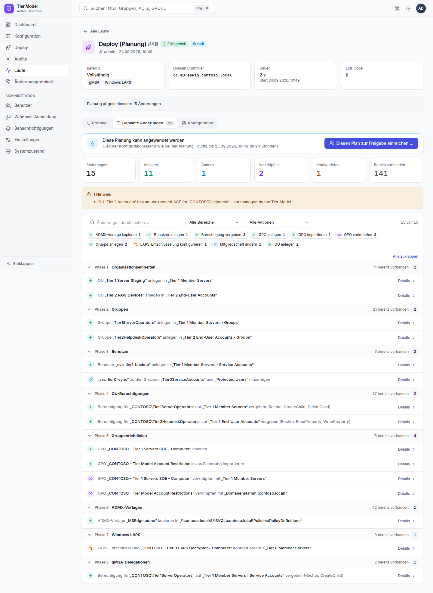

Ist **Anwenden nur nach Planung** aktiv (Standard), lässt sich ein Deploy nur noch aus einer passenden Planung
anwenden: **Diesen Plan anwenden** im Planungslauf bzw. auf der Deploy-Seite der vorgeschlagene Plan. Passend heißt:
erfolgreich, gleicher Bereich, gleiche Add-ons, gleicher Domain Controller, gleiche ADML-Sprache, **gleicher
Konfigurationsstand** und nicht älter als die eingestellte Gültigkeit (Standard 24 Stunden). Der Anwenden-Lauf
verwendet genau die Konfigurationsversionen der Planung. Wurde die Konfiguration danach geändert, muss neu geplant
werden – der Knopf ist dann gesperrt und nennt den Grund.

### Freigabe durch eine zweite Person (Vier-Augen-Prinzip)

Ist unter **Administration › Einstellungen** „Vier-Augen-Prinzip“ aktiv, wird ein Deploy im Modus *Anwenden* nicht
sofort ausgeführt, sondern **zur Freigabe eingereicht** (Status *Wartet auf Freigabe*):

1. Beim Einreichen werden die Versionen aller Konfigurationsbereiche **festgeschrieben**. Ausgeführt wird genau
   dieser Stand – auch wenn die Konfiguration danach weiter bearbeitet wird.
2. Eine **zweite Person mit der Rolle Operator** öffnet den Lauf (Dashboard › *Freigaben ausstehend* oder
   Benachrichtigung), prüft Parameter, festgeschriebene Versionen und die **geplanten Änderungen** des zugehörigen
   Planungslaufs (werden direkt im Freigabefeld angezeigt) und wählt
   **Freigeben** (optional mit Kommentar) oder **Ablehnen** (mit Begründung).
3. Nach der Freigabe läuft der Deploy wie gewohnt. Wer freigegeben hat, steht im Lauf und im Änderungsprotokoll.

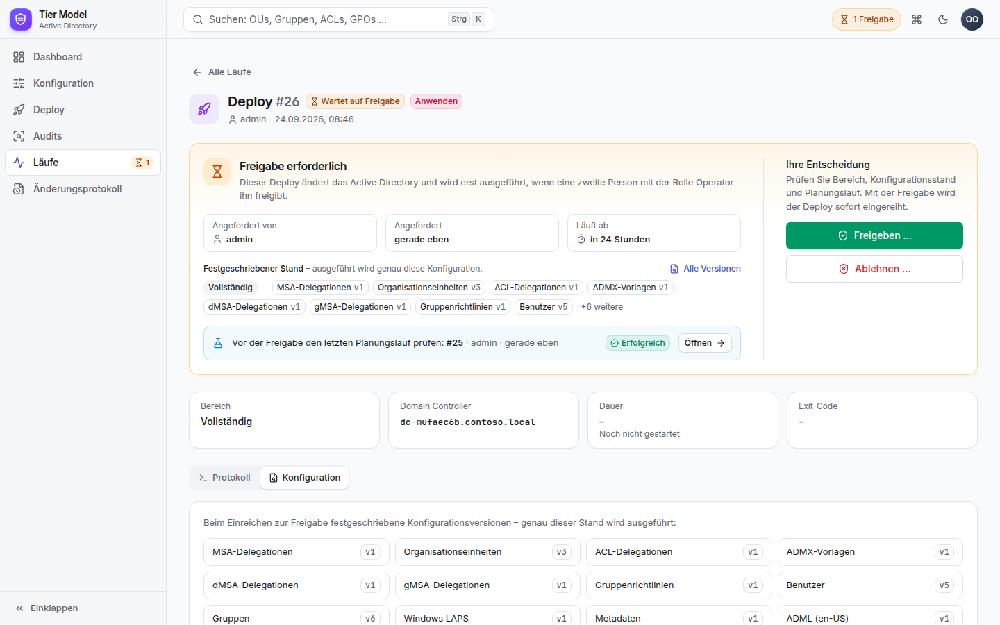

Die antragstellende Person kann den eigenen Antrag nicht freigeben, aber zurückziehen (**Abbrechen**). Anträge, die
nicht innerhalb der eingestellten Frist (Standard 24 Stunden) entschieden werden, verfallen automatisch.

## Audits und Zeitpläne

Unter **Audits** startet man ein Audit sofort (gleiche Parameter wie beim Deploy, ohne Modus) und sieht die
bisherigen Audits mit Anzahl der Abweichungen.

**Zeitpläne** führen Audits automatisch aus:

| Feld | Beispiel |
|---|---|
| Name | „Nächtliches Audit“ |
| Zeitplan | Vorlagen wie „Täglich 02:00“ oder eigener Cron-Ausdruck (`Minute Stunde Tag Monat Wochentag`), z. B. `0 6 * * 1` = montags 06:00 |
| Zeitzone | Standard `Europe/Berlin` (Sommer-/Winterzeit wird berücksichtigt) |
| Parameter | DC, Bereich, Add-ons |

Läuft der vorherige Lauf eines Zeitplans noch, wird der nächste Termin übersprungen. **Jetzt ausführen** startet
einen Zeitplan sofort.

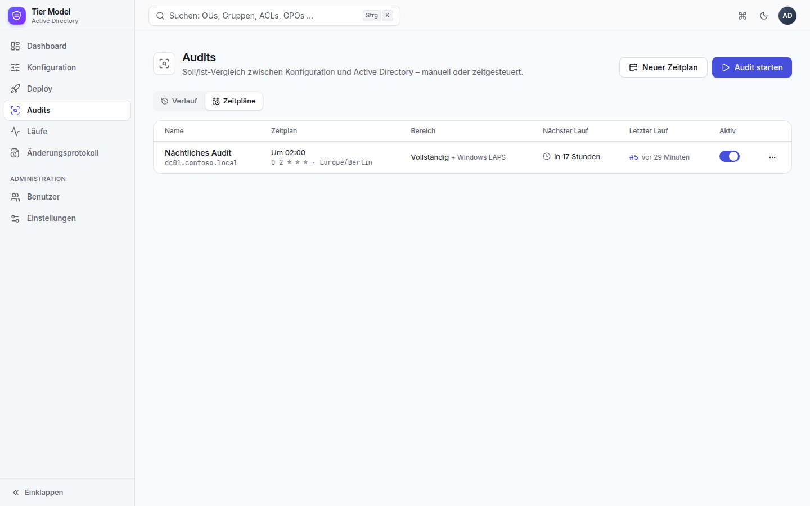

## Privilegierte Zugriffe

Die Seite zeigt den Ist-Zustand der privilegierten Zugriffe im AD. Grundlage ist ein **Überwachungslauf**
(`Watch-TierModelPrivilegedGroups.ps1`, nur lesend): **Jetzt prüfen** (Operator) oder ein Zeitplan vom Typ
*Überwachung* (empfohlen alle 15 Minuten, unter *Audits › Zeitpläne*).

| Reiter | Inhalt |
|---|---|
| **Gruppen** | geschützte Gruppen (z. B. Domänen-Admins, Organisations-Admins, Sicherungs-Operatoren – gefunden über die SID, daher auch in deutschen Domänen) und alle Tier-0-Gruppen der Konfiguration mit ihren Mitgliedern: direkt oder verschachtelt (über welche Gruppe), aktiv/deaktiviert, Bewertung |
| **Änderungen** | Verlauf über alle Überwachungsläufe: wer wurde wann hinzugefügt oder entfernt |
| **Hygiene** | Befunde zu Konten in Tier 0 und Tier 1 |
| **Angriffspfade** | gefährliche Rechte von Nicht-Tier-0-Principals auf Tier-0-Objekten, als Satz mit den Mitgliedern, die das Recht über eine Gruppe erhalten |

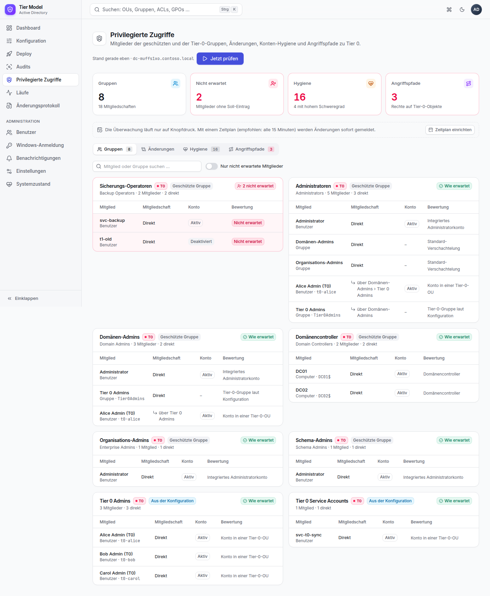

**Nicht erwartet** ist ein Mitglied, das weder eine Tier-0-Gruppe noch ein Tier-0-Konto der Konfiguration ist und
nicht in einer Tier-0-OU liegt. Ausgenommen sind die Standard-Verschachtelungen von Windows (z. B. Domänen-Admins in
Administratoren), das integrierte Administratorkonto und Domänencontroller in ihren Gruppen.

Hygiene-Regeln (Schwellwerte unter *Einstellungen*):

| Regel | Schwere |
|---|---|
| Benutzer mit SPN (Kerberoasting) | Hoch, wenn privilegiert, sonst Mittel |
| „Konto ist vertraulich und kann nicht delegiert werden“ fehlt | Hoch in Tier 0, sonst Mittel |
| Tier-0-Benutzer nicht in *Protected Users* | Mittel |
| Passwort älter als *N* Tage (Standard 365) | Mittel |
| Deaktiviert, aber noch Mitglied einer privilegierten Gruppe | Mittel |
| Keine Anmeldung seit *N* Tagen (Standard 90) | Niedrig |
| Passwort läuft nie ab | Niedrig |
| `adminCount` verwaist (nicht mehr in einer geschützten Gruppe) | Niedrig |

Änderungen, neue nicht erwartete Mitglieder und neue Befunde mit hohem Schweregrad lösen die Benachrichtigung
*Privilegierte Zugriffe* aus.

### Compliance-Wert

Das Dashboard zeigt je Tier einen Wert von 0 bis 100 mit Verlauf der letzten 30 Tage. Abgezogen werden:

| Grundlage | Abzug |
|---|---|
| Audit-Befund (Tier aus dem Objekt) | Hoch 10, Mittel 5, Niedrig 2 |
| nicht erwartetes Mitglied (Tier 0) | 15 |
| Hygiene-Befund (Tier des Kontos) | Hoch 8, Mittel 4, Niedrig 1 |
| Angriffspfad (Tier 0) | 20 |

**Aufschlüsselung** listet die einzelnen Abzüge.

## Befristeter Zugriff (Just-in-Time)

Statt dauerhafter Mitgliedschaft in Admin-Gruppen beantragt man Zugriff auf Zeit (*Befristeter Zugriff*):
**Zugriff beantragen** → Gruppe (nur freigegebene JIT-Gruppen, mit Tier und Höchstdauer), Dauer, Konto (vorbelegt
mit dem eigenen AD-Konto) und Begründung. Ein **anderer Operator** gibt frei oder lehnt ab; danach nimmt der Dienst
das Konto mit Ablaufzeit in die Gruppe auf (AD-Funktion *Privileged Access Management*, Mitgliedschaft mit TTL).
Der Reiter **Aktiv** zeigt die Restzeit; **Entziehen** beendet den Zugriff vorzeitig. Nach Ablauf entfernt das AD
die Mitgliedschaft selbst.

Voraussetzung ist das PAM-Feature der Gesamtstruktur (Gesamtstrukturebene 2016). Der Dienst prüft das
(**Voraussetzungen prüfen**), schaltet es aber **nicht** ein – das Einschalten lässt sich nicht rückgängig machen,
siehe [JIT-Zugriff](../jit-access.md). Administratoren pflegen unter **JIT-Gruppen**, welche Gruppen beantragt werden
können (Höchstdauer, Freigabe nötig, Mindestrolle, berechtigte Benutzer). Wartungsfenster gelten für JIT nicht.
In der Überwachung erscheinen aktive JIT-Mitglieder als *Erwartet (JIT bis …)*.

## Läufe

Die Liste zeigt alle Deploys und Audits mit Status, Auslöser, Dauer und Ergebnis und lässt sich nach Art und Status filtern.

| Status | Bedeutung |
|---|---|
| Wartet auf Freigabe | Deploy/Anwenden, der noch von einer zweiten Person freigegeben werden muss |
| Wartend | in der Warteschlange – Läufe werden nacheinander ausgeführt |
| Läuft | PowerShell arbeitet |
| Erfolgreich | Skript mit Code 0 beendet (ein Audit mit Abweichungen ist trotzdem erfolgreich) |
| Fehlgeschlagen | Skript mit Fehlercode beendet, Validierungsfehler, Zeitüberschreitung oder Dienst-Neustart |
| Abgebrochen | durch einen Operator abgebrochen oder vom Antragsteller zurückgezogen |
| Abgelehnt | Freigabe verweigert oder Frist abgelaufen |
| Geplant | Anwenden wartet auf das nächste Wartungsfenster |

Die Detailseite eines Laufs enthält:

- **Protokoll**: Live-Ausgabe mit Zeitstempel, farbig nach Fehler/Warnung/Erfolg, Filter, „Nur Probleme“,
  Kopieren und Herunterladen. „Folgen“ scrollt automatisch mit.
- **Befunde** (Audits): Zusammenfassung (geprüft, Abweichungen, fehlend, unerwartet, abweichend, verwaiste
  GPO-Links, Sicherheitsabweichungen) und filterbare Befundliste. Bei Audits nur mit Add-ons liefert das Skript
  keine Einzelbefunde; die Anzahl der Abweichungen stammt dann aus der Zeile „Total Drift“ im Protokoll.
- **Konfiguration**: welche Version jedes Bereichs der Lauf verwendet hat.
- **Abbrechen** (Operator): beendet den PowerShell-Prozess samt Unterprozessen.

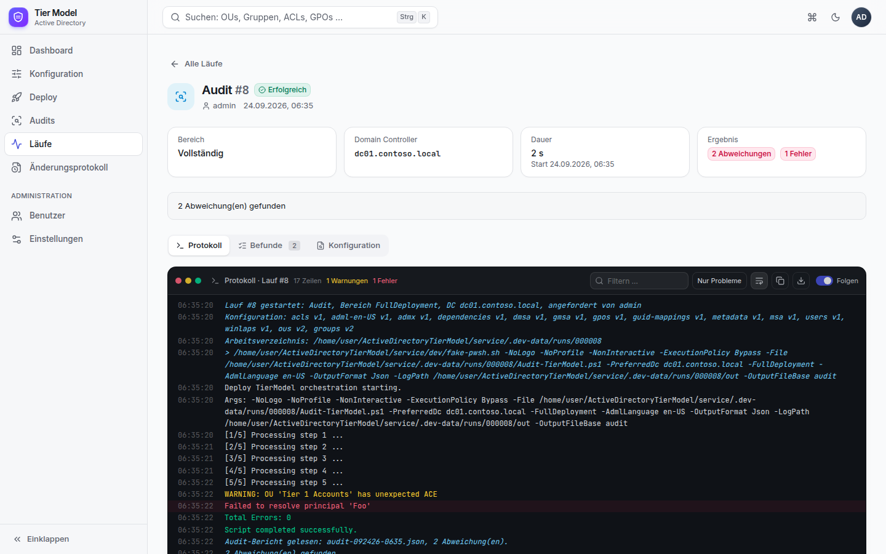

## Änderungsprotokoll

Chronologisch nach Tagen: Konfigurationsänderungen (mit Versionssprung und Kommentar), gestartete und abgebrochene
Läufe, Zeitpläne, Benutzerverwaltung, Einstellungen sowie An- und fehlgeschlagene Abmeldungen. Filterbar nach Art;
Details lassen sich aufklappen.

## Administration

**Benutzer**: anlegen (mit Passwortgenerator), Anzeigename, Rolle und Aktiv-Status ändern, Passwort zurücksetzen,
entsperren, löschen. Das eigene Konto kann weder gelöscht noch herabgestuft werden, und der letzte aktive
Administrator bleibt immer erhalten. Änderungen an Rolle, Status oder Passwort beenden die Sitzungen des
betroffenen Kontos sofort.

**Windows-Anmeldung**: Anmeldung mit Windows-Konto ein-/ausschalten und je Rolle die AD-Gruppen festlegen
(`DOMÄNE\Gruppe` oder SID). Voraussetzungen siehe [Betrieb › Windows-Anmeldung](betrieb.md#windows-anmeldung-einrichten).

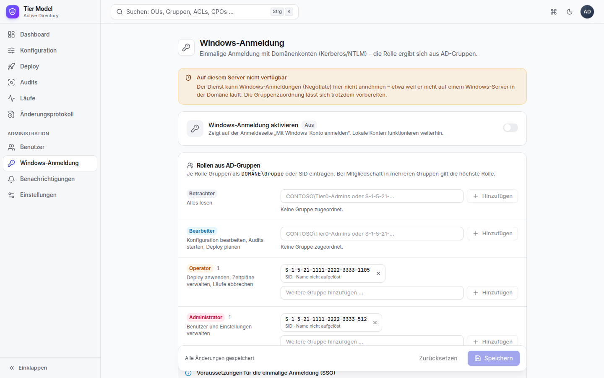

**Benachrichtigungen**: SMTP-Server und beliebig viele Kanäle (E-Mail, Microsoft Teams, Webhook). Je Kanal lässt sich
wählen, bei welchen Ereignissen er benachrichtigt wird:

| Ereignis | Wann |
|---|---|
| Drift | ein Audit hat Abweichungen gefunden |
| Fehler | ein Lauf ist fehlgeschlagen |
| Anwenden | ein Deploy hat Änderungen im AD angewendet |
| Freigabe | ein Deploy wartet auf Freigabe |
| (Syslog / Log Analytics) | zusätzlich: alle Einträge des Änderungsprotokolls und jeder neue Überwachungsbefund, siehe [SIEM](betrieb.md#siem-anbindung) |
| Zertifikat | das HTTPS-Zertifikat läuft in weniger als 30 Tagen ab (täglich geprüft) |
| Privilegierte Zugriffe | Mitglieder geschützter Gruppen geändert, neues nicht erwartetes Mitglied oder neuer Befund mit hohem Schweregrad |

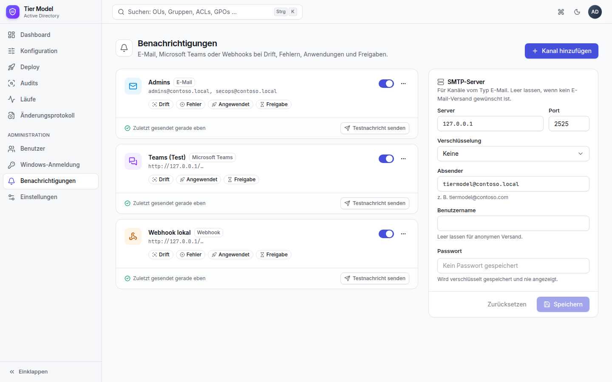

**Testnachricht senden** prüft einen Kanal sofort; der letzte Fehler eines Kanals wird angezeigt. Einrichtung siehe
[Betrieb › Benachrichtigungen](betrieb.md#benachrichtigungen-einrichten).

**Einstellungen**:

| Einstellung | Bedeutung |
|---|---|
| Standard-Domain-Controller | Vorbelegung in Deploy, Audit und Zeitplänen |
| ADML-Sprache | Standard für `-AdmlLanguage` |
| Vier-Augen-Prinzip | Deploys im Modus *Anwenden* brauchen die Freigabe einer zweiten Person |
| Freigabefrist (Stunden) | danach verfällt ein Antrag automatisch |
| Anwenden nur nach Planung | *Anwenden* nur aus einem passenden, erfolgreichen Planungslauf (Standard: an) |
| Gültigkeit einer Planung (Stunden) | so lange lässt sich eine Planung anwenden (Standard 24) |
| Inaktiv nach (Tage) | Hygiene: Konto ohne Anmeldung (Standard 90) |
| Maximales Passwortalter (Tage) | Hygiene: Passwort zu alt (Standard 365) |
| Öffentliche Adresse | z. B. `https://tiermodel01.contoso.com:8443` – für Links in Benachrichtigungen |
| Aufbewahrung von Läufen (Tage) | Protokollzeilen und Arbeitsverzeichnisse älterer Läufe werden gelöscht; Status, Ergebnis und Befunde bleiben. `0` = unbegrenzt |

**Einrichtung** (Admin): Solange die mitgelieferte Beispielkonfiguration noch unverändert ist, bietet das Dashboard
*Einrichtung abschließen* an: 1. Domäne und Domain Controller, 2. Struktur und GPO-Präfix (Vorschau der
Umbenennungen), 3. vorhandene OUs aus dem AD übernehmen, 4. erste Planung starten. *Überspringen* blendet den
Hinweis dauerhaft aus.

**Wartungsfenster**: *Anwenden* ist nur innerhalb der Fenster erlaubt (Wochentage, Uhrzeit von–bis, Zeitzone; ein
Fenster über Mitternacht ist möglich). Solange kein Fenster aktiv ist, gibt es keine Einschränkung. Außerhalb eines
Fensters wird ein Deploy als **Geplant für …** eingereiht und startet automatisch zu Beginn des nächsten Fensters
(abbrechbar). **Sperrzeiten** (z. B. Jahresabschluss) lehnen *Anwenden* ab; geplante Läufe rücken hinter die
Sperrzeit. Planungen, Audits und Überwachung sind nie eingeschränkt. Die Deploy-Seite zeigt das nächste Fenster bzw.
eine aktive Sperrzeit an.

**Berichte**: *Soll/Ist* (letztes Audit), *Änderungen im Zeitraum* (Konfigurationsversionen, Läufe, Freigaben,
Änderungsprotokoll) und *Privilegierte Zugriffe* (letzte Überwachung, Compliance-Wert) als Vorschau oder PDF.
Administratoren können Berichte wöchentlich oder monatlich per E-Mail versenden lassen.

**Entra-ID-Anmeldung**: siehe [Betrieb › Entra ID](betrieb.md#entra-id-anmeldung-einrichten).

**Systemzustand**: Ampel über alle Prüfpunkte – Anwendung (Version, Laufzeit), HTTPS-Zertifikat (Ablauf),
Datenbank (Größe, Migrationen), Warteschlange, letzte erfolgreiche Läufe, freier Platz im Arbeitsverzeichnis,
PowerShell, Framework, Hintergrunddienste und Schlüsselspeicher. Jeder Punkt nennt bei *Hinweis* oder *Fehler*, was zu
tun ist.

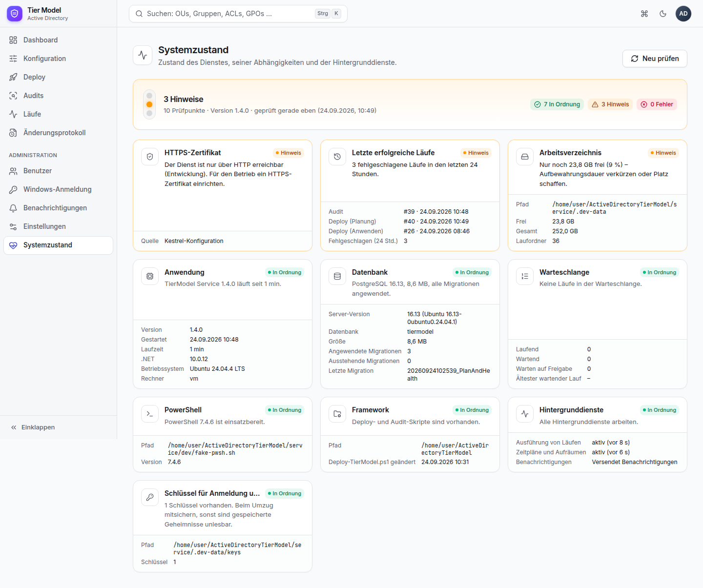

Framework- und PowerShell-Pfad werden angezeigt, sind aber nur in der Dienstkonfiguration änderbar
([Betrieb](betrieb.md#konfigurationsdatei)).
